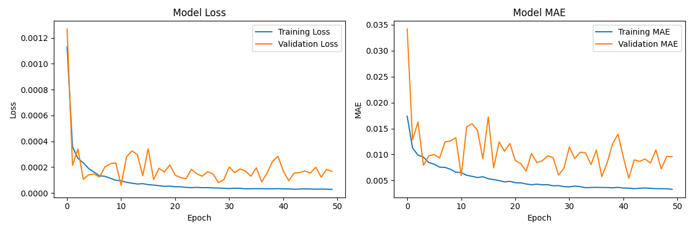

# ETH 实时价格预测系统

这是一个基于 LSTM 深度学习模型的 ETH 加密货币实时价格预测和自动交易系统。该系统通过 Binance API 获取实时价格数据，结合多种技术指标和 BTC 相关性特征进行预测，并通过概率分布分析生成交易信号，执行模拟交易。


# 预测模型的基本表现
1. **模型指标**


2. **训练表现及测试表现**


3. **预测表现**


## 项目结构

```
ETH 价格预测系统/
├── README.md                 # 项目说明文档
├── requirements.txt          # 项目依赖
├── models/                   # 模型文件目录
│   └── eth_price_predictor_1h_v8.keras  # LSTM模型文件
├── src/                     # 源代码目录
│   ├── api.py              # Web API 接口模块
│   ├── config.py           # 全局配置管理模块
│   ├── models.py           # 数据模型定义模块
│   ├── data_fetcher.py      # 数据获取模块
│   ├── predictor.py         # 预测模块
│   ├── utils.py             # 工具模块
│   ├── simulator.py         # 模拟交易模块
│   ├── trading_signals.py   # 交易信号生成模块
│   ├── run_simulation.py    # 运行模拟交易主程序
│   └── static/             # 静态资源目录
│       └── index.html       # Web 界面主页
└── log/                     # 日志目录
    └── session_[timestamp]/ # 每个交易会话的日志目录
```

## 功能特点

1. **数据获取与预处理 (data_fetcher.py)**
   - 通过 Binance API 获取 ETH 和 BTC 实时价格数据
   - 支持自定义K线间隔（默认1小时）和回溯天数（默认30天）
   - 内置自动重试机制和请求限制处理
   - 完整的数据清洗和预处理流程

2. **技术指标分析 (utils.py)**
   - 趋势指标：
     * 多周期移动平均线 (MA7/10/20/30/60)
     * MACD (Moving Average Convergence Divergence)
     * 布林带 (Bollinger Bands)
   - 动量指标：
     * RSI (Relative Strength Index)
     * KDJ 指标
     * CCI (Commodity Channel Index)
     * Momentum
   - 波动指标：
     * ATR (Average True Range)
     * 标准差 (Standard Deviation)
   - 成交量指标：
     * OBV (On Balance Volume)
     * 成交量变化率
   - 市场关联性指标：
     * ETH/BTC 价格差和比率
     * ETH/BTC 移动平均线对比
     * ETH/BTC 成交量相关性

3. **价格预测系统 (predictor.py)**
   - LSTM 深度学习模型
   - 集成预测方法：
     * 每次生成 200 次预测结果
     * 添加随机噪声提高稳健性
     * 考虑价格波动率（当前价格的 2%）
   - 预测结果分析：
     * 计算六个价格区间的概率分布
     * 生成预测分布可视化图表
     * 实时跟踪预测准确率

4. **交易信号系统 (trading_signals.py)**
   - 七种信号类型：
     * 强看涨 (strong_bullish): 上涨概率 ≥ 75%，中高幅度涨幅概率 ≥ 35%
     * 中性看涨 (moderate_bullish): 上涨概率 ≥ 65%，中高幅度涨幅概率 ≥ 20%
     * 弱看涨 (weak_bullish): 上涨概率 ≥ 55%
     * 强看跌 (strong_bearish): 下跌概率 ≥ 75%,中高幅度跌幅概率 ≥ 35%
     * 中性看跌 (moderate_bearish): 下跌概率 ≥ 65%,中高幅度跌幅概率 ≥ 20%
     * 弱看跌 (weak_bearish): 下跌概率 ≥ 55%
     * 中性 (neutral): 其他情况

5. **模拟交易系统 (simulator.py)**
   - 资金管理:
     * 初始资金 20,000 元
     * 单位化仓位管理（每单位 2,500 元）
     * 最大持仓 5 个单位
   - 风险控制:
     * 动态持仓计算
     * 最大回撤跟踪
     * 收益率统计
   - 交易记录：
     * 详细的交易历史
     * 持仓时长统计
     * 盈亏分析
     * 胜率统计

6. **会话管理系统 (run_simulation.py)**
   - 独立会话目录管理
   - 自动等待下一个整点执行
   - 完整的日志记录：
     * 预测日志 (prediction_log.csv)
     * 交易历史 (trade_history.json)
     * 交易模拟器日志 (trading_simulator.log)
     * 预测分布图 (latest_distribution.png)

7. **Web API 和可视化界面 (api.py & static/)**
   - RESTful API 接口：
     * `/api/trading-data`: 获取详细交易数据
     * `/api/trades`: 获取所有交易记录
     * `/api/summary`: 获取交易统计摘要
     * `/api/trading-data-simplified`: 获取简化版交易数据
   - 实时数据展示界面：
     * 交易数据可视化
     * 实时收益率曲线
     * 交易历史记录
   - 启动方式：
     ```bash
     uvicorn api:app --reload --app-dir src
     ```

8. **全局配置管理 (config.py)**
   - 集中管理所有配置项：
     * 数据库配置
     * 交易模拟器配置
     * 文件路径配置
     * API配置
     * 模型配置
   - 配置更新流程：
     1. 修改 `config.py` 中的相关配置
     2. 如需添加新模型，更新 `get_model_config()` 方法
     3. 所有配置修改立即生效，无需修改其他文件

9. **数据模型管理 (models.py)**
   - SQLAlchemy ORM 模型定义：
     * `TradingSnapshot`: 交易快照数据
     * `Trade`: 交易记录
   - 数据库表结构：
     * 自动创建和管理数据库表
     * 支持 SQLite 数据库
     * 完整的交易数据存储

## 安装步骤

1. **环境要求**
   - Python 3.8 或更高版本
   - 稳定的网络连接（用于访问 Binance API）

2. **安装依赖**
```bash
pip install -r requirements.txt
```

主要依赖包括：
- numpy==1.24.3
- pandas==2.0.3
- tensorflow==2.13.0
- requests==2.31.0
- matplotlib==3.7.1
- ta-lib==0.4.28
- scikit-learn==1.3.0

3. **运行系统**
```bash
python src/run_simulation.py
```

## 注意事项

1. 确保网络连接稳定，以便持续获取 Binance API 数据
2. 建议使用 screen 或 nohup 在服务器上运行，确保程序持续运行
3. 定期检查日志文件，监控系统运行状态
4. 预测结果和交易信号仅供参考，不构成投资建议
5. 注意 Binance API 的访问频率限制
6. 建议定期备份交易历史和日志数据

## 更新流程

1. **添加新的预测模型**
   1. 将新模型文件放入 `models/` 目录
   2. 在 `config.py` 中更新模型配置：
      ```python
      @classmethod
      def get_model_config(cls):
          return {
              "model_path": str(cls.MODELS_DIR / "new_model.pkl"),
              "model_params": {
                  "input_size": 10,
                  "output_size": 1,
                  "hidden_size": 64
              }
          }
      ```
   3. 如需要，更新 `predictor.py` 中的预测逻辑

2. **修改交易参数**
   1. 在 `config.py` 中更新交易配置：
      ```python
      INITIAL_CAPITAL = 200_000.0  # 修改初始资金
      UNIT_SIZE = 20_000.0        # 修改交易单位大小
      MAX_UNITS = 5.0            # 修改最大交易单位数
      ```

3. **自定义 Web 界面**
   1. 在 `static/` 目录中修改相关文件：
      - `index.html`: 更新页面结构
      - `css/`: 修改样式文件
      - `js/`: 更新交互逻辑
   2. 如需添加新的 API 接口，在 `api.py` 中定义

4. **数据库结构变更**
   1. 在 `models.py` 中更新数据模型定义
   2. 删除旧的数据库文件（如果存在）
   3. 重新运行程序，会自动创建新的数据库结构

## 开发计划

- [ ] 优化 LSTM 模型架构，提高预测准确率
- [ ] 添加更多技术指标和市场情绪指标
- [ ] 实现实盘交易接口
- [ ] 增加动态风险管理模块
- [ ] 支持更多交易策略
- [ ] 添加 Web 界面，实时展示交易状态和性能指标

## 许可证

MIT License

## 已知限制

1. **会话管理和数据库耦合**
   - 每次启动系统时都会新建一个会话，但所有会话都写入同一个数据库
   - 不同会话之间的数据会相互影响，可能导致数据混乱
   - 需要使用 `clear_all_data.py` 脚本来重置数据库内容
   - 预测模块和展示模块之间存在耦合，未能完全分离
